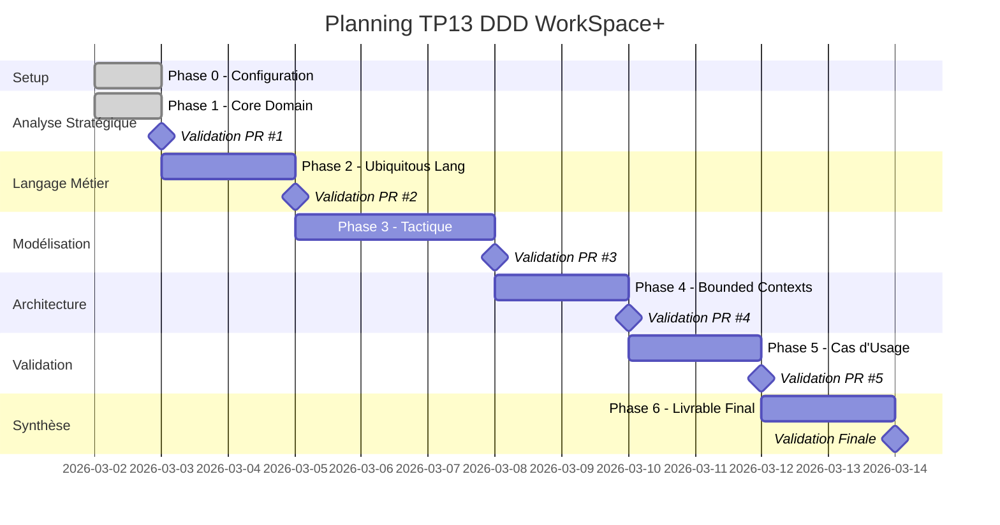

# Roadmap Projet TP13 DDD WorkSpace+

## Vue d'Ensemble du Projet

### 🎯 Objectif Final
Concevoir l'architecture métier d'une plateforme SaaS de gestion d'espaces de coworking en appliquant rigoureusement les principes du Domain-Driven Design.

### 📅 Planning Prévisionnel

## État d'Avancement Détaillé

### Phase 0 - Setup Projet ✅
- **Statut** : ✅ Terminée  
- **Date** : 02/03/2026
- **Livrables** :
  - ✅ Repository GitHub configuré
  - ✅ Structure de dossiers organisée  
  - ✅ Templates PR et workflow Git
  - ✅ Documentation d'organisation

### Phase 1 - Analyse Stratégique ✅
- **Statut** : ✅ Terminée (mergée)
- **Date** : 02/03/2026
- **Branche** : `feat/phase-1-core-domain-analysis`
- **PR** : #1 - https://github.com/benoit-bremaud/tp13-ddd-workspace-plus/pull/1
- **Livrables** :
  - ✅ `analysis/phase-1-core-domain.md` (183 lignes d'analyse)
  - ✅ `diagrams/domain-overview.mmd` (diagramme stratégique)
- **Décisions Clés** :
  - 🎯 **Core Domain identifié** : "Politique Tarifaire & Optimisation d'Occupation"
  - 📊 **Classification** : 1 Core + 3 Supporting + 4 Generic Domains
  - 🏗️ **Stratégie d'investissement** architectural définie

### Phase 2 - Ubiquitous Language ✅
- **Statut** : ✅ Terminée (mergée)
- **Branche** : `feat/phase-2-ubiquitous-language`
- **PR** : #2 - https://github.com/benoit-bremaud/tp13-ddd-workspace-plus/pull/2
- **Livrables** :
  - `analysis/phase-2-ubiquitous-language.md`
  - `docs/glossary.md` (dictionnaire des termes métier)

### Phase 3 - Modélisation Tactique ✅
- **Statut** : ✅ Terminée (mergée)
- **Branche** : `feat/phase-3-tactical-modeling`
- **PR** : #3 - https://github.com/benoit-bremaud/tp13-ddd-workspace-plus/pull/3
- **Complexité** : 🔴 Élevée (cœur du DDD tactique)
- **Livrables** :
  - `analysis/phase-3-tactical-modeling.md`
  - `diagrams/entities-value-objects.mmd`
  - `diagrams/aggregates.mmd` 
  - (services de domaine documentés dans l'analyse)

### Phase 4 - Bounded Contexts ✅
- **Statut** : ✅ Terminée (mergée)
- **Branche** : `feat/phase-4-bounded-contexts`
- **PR** : #4 - https://github.com/benoit-bremaud/tp13-ddd-workspace-plus/pull/4
- **Complexité** : 🟡 Moyenne
- **Focus** : Architecture distribuée et Context Map

### Phase 5 - Validation par Cas d'Usage ✅
- **Statut** : ✅ Terminée (mergée)
- **Branche** : `feat/phase-5-use-cases-validation`
- **PR** : #5 - https://github.com/benoit-bremaud/tp13-ddd-workspace-plus/pull/5
- **Complexité** : 🟡 Moyenne
- **Criticité** : 🔥 Élevée (validation du modèle)

### Phase 6 - Livrable Final ✅
- **Statut** : ✅ Terminée (mergée)
- **Branche** : `feat/phase-6-final-deliverable`
- **PR** : #6 - https://github.com/benoit-bremaud/tp13-ddd-workspace-plus/pull/6
- **Focus** : Document d'architecture professionnel consolidé

## Métriques de Progression

### Avancement Global
- **Phases complétées** : 6/6 (100%)
- **Phase en cours** : Aucune (projet finalisé)
- **Analyses produites** : phases 1 à 6 (finalisées)
- **Diagrammes créés** : domain overview, entities/value objects, aggregates, context map, use-cases flow
- **PRs mergées** : 6

### Qualité du Travail
- ✅ **Méthodologie DDD** : Respectée (approche stratégique → tactique)
- ✅ **Argumentation** : Rigoureuse et justifiée
- ✅ **Organisation Git** : Workflow professionnel  
- ✅ **Documentation** : Structurée et complète

## Risques et Mitigation

### 🔴 Risques Identifiés
1. **Complexité Phase 3** : Modélisation tactique dense
   - **Mitigation** : Commits très fréquents, validation par étapes
   
2. **Cohérence inter-phases** : Risque d'incohérence conceptuelle
   - **Mitigation** : Révision systématique des phases précédentes
   
3. **Qualité argumentation** : Niveau académique exigeant
   - **Mitigation** : Justification systématique de chaque choix DDD

### 🟡 Points d'Attention
- **Alignment métier/technique** : Maintenir le focus business
- **Évolutivité du modèle** : Anticiper les extensions futures
- **Validation pratique** : S'assurer que le modèle fonctionne

## Jalons Critiques

### 🎯 Milestone 1 - Fondations Établies
- **Date cible** : 03/03/2026
- **Critères** : Phase 1 validée + Phase 2 démarrée
- **Impact** : Base solide pour la modélisation tactique

### 🎯 Milestone 2 - Modèle DDD Complet  
- **Date cible** : 07/03/2026
- **Critères** : Phases 1-4 validées
- **Impact** : Architecture DDD opérationnelle

### 🎯 Milestone 3 - Validation Finale
- **Date cible** : 10/03/2026
- **Critères** : Toutes phases + Document d'architecture
- **Impact** : TP13 DDD complet et professionnel

---

**Ce roadmap assure une progression maîtrisée vers l'excellence architecturale DDD pour WorkSpace+.**